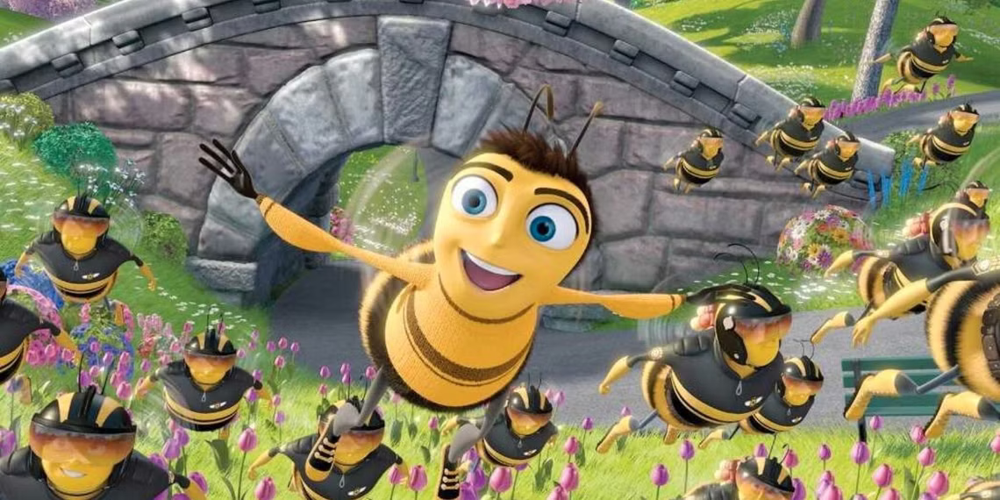

# 🐝 Cibeelization

> "*O todo sem a parte não é todo; A parte sem o todo não é parte; Mas se a parte o faz todo, sendo parte; Não se diga, que é parte, sendo todo.*" - Gregório de Matos

**Disciplina**: FGA0210 - PARADIGMAS DE PROGRAMAÇÃO - T01 <br>
**Número do Grupo**: 02<br>
**Paradigma**: SMA<br>

## Alunos
| Matrícula  | Aluno                              |
| ---------- | ---------------------------------- |
| 21/1039288 | Bruno Campos Ribeiro               |
| 21/1039297 | Bruno Martins Valério Bomfim       |
| 20/2016462 | Heitor Marques                     |
| 21/1029352 | Igor e Silva Penha                 |
| 19/0057858 | José Luís Ramos Teixeira           |
| 21/1029405 | Leonardo Gonçalves Machado         |
| 20/2016767 | Lucas Felipe Soares                |
| 20/0062379 | Marcos Vinícius de Deus            |
| 20/2045268 | Raquel T. Eucária Pereira da Costa |
| 21/2002907 | Zenilda Pedrosa Vieira             |

## Sobre
**Cibeelization** é um projeto que visa simular as dinâmicas de uma colmeia de abelhas, onde as abelhas - com classe, funções e comportamento definidos - interagem entre si em pról do desenvolvimento e equilíbrio da sociedade como um todo, criando assim um ecossistema dinâmico e complexo.

O projeto foi desenvolvido na linguagem *Java* e utiliza a tecnologia de sistemas multiagentes (SMA), baseando-se no framework JADE e utilizando o protocolo FIPA para comunicação e troca de mensagens entre os agentes.

<!-- ? -->

<div align='center'><center>


<label><a href="https://en.wikipedia.org/wiki/Bee_Movie">Bee Movie</a> (2007).</label>

</center></div>


As classes de agentes presentes no **Cibeelization** incluem:

* **Rainha:** Cria novas operárias periodicamente.
* **Operárias:** Produzem mel/Geleia Real ou atacam intrusos quando detectados.
* **Limpadoras:** Limpam os resíduos gerados pela produção de mel e geleia real pelas abelhas operárias. Tal produção é interrompida quando a quantidade de resíduo atinge um limite máximo.
* **Intruso:** Aparece periodicamente e precisa ser combatido pelas operárias.
* **Zangão:** Ajuda na proteção da colmeia e na reprodução com a rainha.

Mais detalhes sobre os agentes, os requisitos funcionais e os não-funcionais podem ser lidos na íntegra na documentação da [descrição do projeto](docs/descricao-projeto.md).

## Screenshots
<div align='center'>
  <br><br>
  <label><strong> Imagem 1:</strong> Descrição da imagem <br> <strong>Fonte:</strong> <a href="https://github.com/fulano">Fulano de Tal</a>, 2025.</label><br><br><br>
  <br><br>
  <label><strong>Imagem 2:</strong> Descrição da imagem<br> <strong>Fonte:</strong> <a href="https://github.com/fulano"> Fulano de Tal</a> e <a href="https://github.com/deltrano">Deltrano Beltrano</a>, 2025.</label><br><br>
</div>

## Instalação

1. **Certifique-se de ter os pré-requisitos instalados:**  
   - Java Development Kit (JDK) 8 ou superior.  
   - JADE Framework.  
   - Make (para usar o Makefile).  

2. **Clone o repositório:**  
   ```bash
   git clone https://github.com/UnBParadigmas2024-2/2024.2_G2_SMA_Cibeelization
   
   cd 2024.2_G2_SMA_Cibeelization
## Uso

Para executar o projeto, basta executar o makefile através dos seguintes passos.

1. **Certifique-se de ter instalado o projeto corretamente (seção anterior).**

2. **Uma vez dentro do projeto, navegue até a pasta principal:**  
   ```bash
   cd cibeelization/

3. **Execute o makefile:**  
   ```bash
   make

4. **Após finalizar a execução, limpe os arquivos de compilação:**  
   ```bash
   make clean

## Vídeo

## Participações

| Nome do Membro | Contribuição | Significância da Contribuição para o Projeto (Excelente/Boa/Regular/Ruim/Nula) | Comprobatórios |
| --- | --- | --- | --- |
| Bruno Campos Ribeiro          | (1) Participação nas reuniões do grupo, definição e elicitação de requisitos para o projeto.<br>(2) Auxilio no funcionamento da Rainha.<br>(3) Realização da rinha de rainhas.<br>(4) Operárias se tornando rainha.<br>(5) BugFix. | Excelente | (2)/(3)/(4) [Commit e5a9347](https://github.com/UnBParadigmas2024-2/2024.2_G2_SMA_Cibeelization/commit/e5a934752b48dd9fcaaafa364d37384d87363526)<br>(5) [Commit 389d16c](https://github.com/UnBParadigmas2024-2/2024.2_G2_SMA_Cibeelization/commit/389d16c955b761c7ad8113ef96ab3d0a799812da), [Commit a9be9a1](https://github.com/UnBParadigmas2024-2/2024.2_G2_SMA_Cibeelization/commit/a9be9a198a450792fbf9fd5bec9f61cb6011e257) |
| Bruno Martins Valério Bomfim  | (1) Participação nas reuniões do grupo, definição e elicitação de requisitos para o projeto.<br>(2) Estudos: criação de prints para debug.<br>(3) Estudos: teste de criação do agente Planta (não foi para a upstream).<br>(4) Criação da primeira versão funcional do programa.<br>(5) Abelha-rainha: criação, implementação e aperfeiçoamento.<br>(6) Abelha-operária: criação, implementação e aperfeiçoamento.<br>(7) Abelha-zangão: criação, implementação e aperfeiçoamento.<br>(8) Abelha-limpadora: criação, implementação e aperfeiçoamento.<br>(9) Bugfix: correção de bugs, ajuste de constantes, testes.<br>(10) Documentação: escrita do README, documentação técnica do projeto, participações.<br>(11) Documentação: criação do gitignore.<br>(12) Participação do vídeo de entrega.<br>(13) Auxílio da criação da InspectorBee | Excelente | (1) [Issue #2](https://github.com/UnBParadigmas2024-2/2024.2_G2_SMA_Cibeelization/issues/2) <br> (2) [Branch consertaPrints](https://github.com/UnBParadigmas2024-2/2024.2_G2_SMA_Cibeelization/tree/consertaPrints) <br> (3) [Branch plant](https://github.com/UnBParadigmas2024-2/2024.2_G2_SMA_Cibeelization/tree/plant) <br> (4) [Commit 3f92d58](https://github.com/UnBParadigmas2024-2/2024.2_G2_SMA_Cibeelization/commit/3f92d582d240d78fee0192d669051dd2f309fa57) <br> (5) [Commit ffaa000](https://github.com/UnBParadigmas2024-2/2024.2_G2_SMA_Cibeelization/commit/ffaa000037ca418edf51f5d322006ae38b02c285), [Commit a034add](https://github.com/UnBParadigmas2024-2/2024.2_G2_SMA_Cibeelization/commit/a034add2ab164f07d6ef253467af989cdeae78b8) <br> (6) [Commit 79cf024](https://github.com/UnBParadigmas2024-2/2024.2_G2_SMA_Cibeelization/commit/79cf024b73199494f4cd82c296c03c91a29de10f), [Commit a034add](https://github.com/UnBParadigmas2024-2/2024.2_G2_SMA_Cibeelization/commit/a034add2ab164f07d6ef253467af989cdeae78b8) <br> (7) [Commit 3f92d58](https://github.com/UnBParadigmas2024-2/2024.2_G2_SMA_Cibeelization/commit/3f92d582d240d78fee0192d669051dd2f309fa57) <br> (8) [Commit d87b2be](https://github.com/UnBParadigmas2024-2/2024.2_G2_SMA_Cibeelization/commit/d87b2bef13db4edda679cf07070f32841c54e474), [Commit 1e55bd3](https://github.com/UnBParadigmas2024-2/2024.2_G2_SMA_Cibeelization/commit/1e55bd339f95ba8b4559d81451ba05641e4b4908), [Commit 5ffa99f](https://github.com/UnBParadigmas2024-2/2024.2_G2_SMA_Cibeelization/commit/5ffa99f759900b2029970f0e099210494cef3032), [Commit 389d16c](https://github.com/UnBParadigmas2024-2/2024.2_G2_SMA_Cibeelization/commit/389d16c955b761c7ad8113ef96ab3d0a799812da) <br> (9) [Commit a034add](https://github.com/UnBParadigmas2024-2/2024.2_G2_SMA_Cibeelization/commit/a034add2ab164f07d6ef253467af989cdeae78b8), [Commit 389d16c](https://github.com/UnBParadigmas2024-2/2024.2_G2_SMA_Cibeelization/commit/389d16c955b761c7ad8113ef96ab3d0a799812da), [Commit a9be9a1](https://github.com/UnBParadigmas2024-2/2024.2_G2_SMA_Cibeelization/commit/a9be9a198a450792fbf9fd5bec9f61cb6011e257) <br> (10) [Commit d6850b6](https://github.com/UnBParadigmas2024-2/2024.2_G2_SMA_Cibeelization/commit/d6850b68119621953501c8810bb39c031f26012d), [Commit e7b182b](https://github.com/UnBParadigmas2024-2/2024.2_G2_SMA_Cibeelization/commit/e7b182b37c0d4066648f7f6c6d33a4d0ad325f03), [Commit 3d397f8](https://github.com/UnBParadigmas2024-2/2024.2_G2_SMA_Cibeelization/commit/3d397f8717cd377b8b3ddec121a7b467b8fb7760), [Commit 91480da](https://github.com/UnBParadigmas2024-2/2024.2_G2_SMA_Cibeelization/commit/91480da3de065cdc4024c08012fdf1f79a7dfdfc), [Commit 29dea0d](https://github.com/UnBParadigmas2024-2/2024.2_G2_SMA_Cibeelization/commit/29dea0dffba18e6c2c36fbaccd97cadb4c4af945), [Commit e753b83](https://github.com/UnBParadigmas2024-2/2024.2_G2_SMA_Cibeelization/commit/e753b83f5dd278e2ee6be82928c3c6303987a4cd) <br> (11) [Commit 511e82a](https://github.com/UnBParadigmas2024-2/2024.2_G2_SMA_Cibeelization/commit/511e82a16ef9a063c1b8040790ec29e308ad910a) <br> (12)  [Vídeo]() <br> (13) [Commit 7c0ff7d](https://github.com/UnBParadigmas2024-2/2024.2_G2_SMA_Cibeelization/commit/7c0ff7d163675d7afe6046f87dc5ac77830980c0) |
| Heitor Marques                |                                               |                                             |                                        |
| Igor e Silva Penha            | (1) Participação nas reuniões do grupo, definição e elicitação de requisitos para o projeto.<br>(2) Auxilio no funcionamento da Rainha.<br>(3) Criação do voo nupicial.<br>(4) Realização da rinha de rainhas.<br>(5) Criação da abelha limpadora.<br>(6) Operárias se tornando rainha.<br>(7) Implementação da alimentação e morte por fome da operária e limpadora.<br>(8) Geração de resíduos ao produzir mel.<br>(9) Produção da abelha Inspetora.<br>(10) Ajustes das constantes.<br>(11) Correção de bugs.<br>(12) Documentação. | Excelente | (2)/(4)/(6) [rinha](https://github.com/UnBParadigmas2024-2/2024.2_G2_SMA_Cibeelization/commit/e5a934752b48dd9fcaaafa364d37384d87363526)<br>(3) [nupicias](https://github.com/UnBParadigmas2024-2/2024.2_G2_SMA_Cibeelization/commit/ccbe29c81f7c4250b0cdbd09e556ca32107f844a)<br>(5) [limpadora](https://github.com/UnBParadigmas2024-2/2024.2_G2_SMA_Cibeelization/commit/d87b2bef13db4edda679cf07070f32841c54e474)<br>(7) [fome](https://github.com/UnBParadigmas2024-2/2024.2_G2_SMA_Cibeelization/commit/565040d5f47371605ac4a5c89d1c9807066fa38a)<br>(8) [residuos](https://github.com/UnBParadigmas2024-2/2024.2_G2_SMA_Cibeelization/commit/5ffa99f759900b2029970f0e099210494cef3032)<br>(9) [inspetora](https://github.com/UnBParadigmas2024-2/2024.2_G2_SMA_Cibeelization/commit/7c0ff7d163675d7afe6046f87dc5ac77830980c0)<br>(10) [constantes](https://github.com/UnBParadigmas2024-2/2024.2_G2_SMA_Cibeelization/commit/828b3907df0b1fe359016fb0888a6d8bd1bd209f)<br>(11) [bug fixes](https://github.com/UnBParadigmas2024-2/2024.2_G2_SMA_Cibeelization/commit/a034add2ab164f07d6ef253467af989cdeae78b8)|
| José Luís Ramos Teixeira      |                                               |                                             |                                        |
| Leonardo Gonçalves Machado    |                                               |                                             |                                        |
| Lucas Felipe Soares           |(1) Participação na elicitação dos requisitos do projeto.<br>(2) Criação base das abelhas operárias, limpadoras, Zangão e Rainha.<br> (3) Implementação da função de criar mel por parte das operárias, criação de novas abelhas pela abelha rainha e limpeza pelas limpadoras. Criei funções e eventos de mortes e alimentação nesses casos.<br>(4) Auxiliei nos estudos e configurações iniciais do projeto.<br>(5) Documentação geral do projeto e seus requisitos.                                              |      Excelente                                       |  Auxiliei em diversas etapas que podem ser visualizadas via histórico do github em commits autorais e com co-author. Também possuo um histórico ativo de participações em nosso grupo e reuniões/Aulas presenciais. A seguir deixarei alguns dos commits mais relevantes de maneira a melhorar a visualização:<br>[Primeira Versão funcional do projeto(criação das abelhas rainha, zangão e operária)](https://github.com/UnBParadigmas2024-2/2024.2_G2_SMA_Cibeelization/commit/3f92d582d240d78fee0192d669051dd2f309fa57)<br>[coleta de pólem](https://github.com/UnBParadigmas2024-2/2024.2_G2_SMA_Cibeelization/commit/79cf024b73199494f4cd82c296c03c91a29de10f).<br>[Produção de Mel](https://github.com/UnBParadigmas2024-2/2024.2_G2_SMA_Cibeelization/commit/3121d52143a24f29d0b84301179d11f45b1c35ec).<br>[Criação da Abelha Limpadora](https://github.com/UnBParadigmas2024-2/2024.2_G2_SMA_Cibeelization/commit/5ffa99f759900b2029970f0e099210494cef3032).<br>[Documentação dos Requisitos do projeto](https://github.com/UnBParadigmas2024-2/2024.2_G2_SMA_Cibeelization/commit/f1336cbf661187c5de6f33e93b345dcac79fb318).<br>[Etapa de configuração do Jade](https://github.com/UnBParadigmas2024-2/2024.2_G2_SMA_Cibeelization/commit/bc817377946471b975b4336035bf93c60df16854)                                      |
| Marcos Vinícius de Deus       |                                               |                                             |                                        |
| Raquel T. Eucaria Pereira da Costa |                                          |                                             |                                        |
| Zenilda Pedrosa Vieira        |                                               |                                             |                                        |

## Outros

Acesse o relato de cada membro do grupo referente às lições aprendidas, percepções, contribuições, fragilidades e trabalhos futuros através dos links abaixo:

- [Bruno Campos Ribeiro](docs/relatos/brunoRibeiro.md)
- [Bruno Martins Valério Bomfim](docs/relatos/brunoMartins.md)
- [Heitor Marques](docs/relatos/heitor.md)
- [Igor e Silva Penha](docs/relatos/igor.md)
- [José Luís Ramos Teixeira](docs/relatos/jose.md)
- [Leonardo Gonçalves Machado](docs/relatos/leonardo.md)
- [Lucas Felipe Soares](docs/relatos/lucas.md)
- [Marcos Vinícius de Deus](docs/relatos/marcos.md)
- [Raquel T. Eucaria Pereira da Costa](docs/relatos/raquel.md)
- [Zenilda Pedrosa Vieira](docs/relatos/zenilda.md)

## Fontes

[1] SERRANO, Milene. **Materiais da Disciplina de Paradigmas de Programação**. Faculdade de Ciências e Tecnologias em Engenharia (FCTE) – Campus Gama, Universidade de Brasília (UnB). Disponível em: [link](https://aprender3.unb.br/). Acesso em: 06 jan. 2025.

[2] FOUNDATION FOR INTELLIGENT PHYSICAL AGENTS. **FIPA** specifications. Disponível em: http://www.fipa.org/. Acesso em: 26 jan. 2025.
