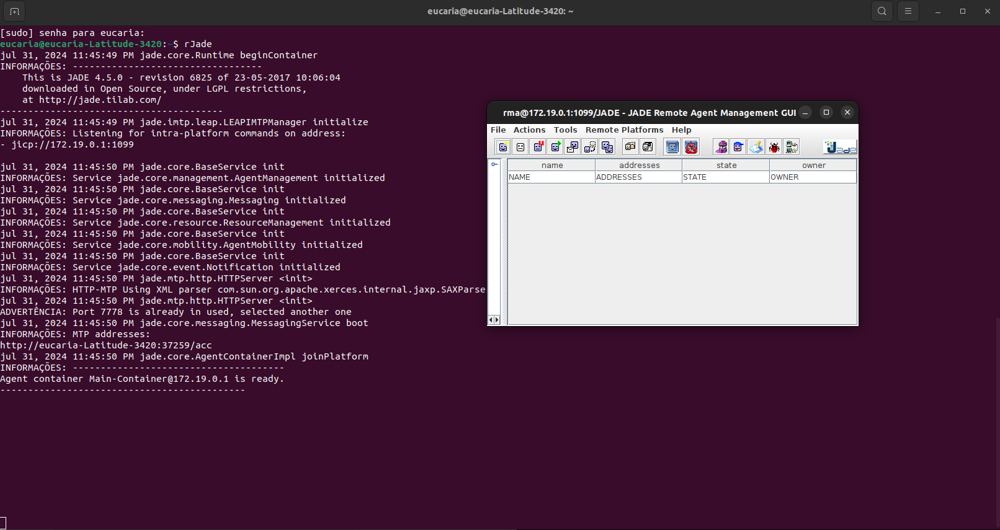
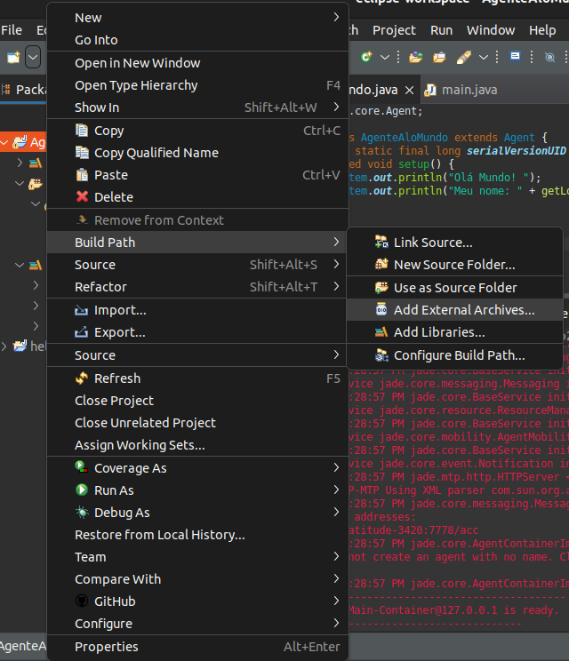
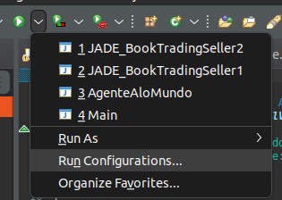
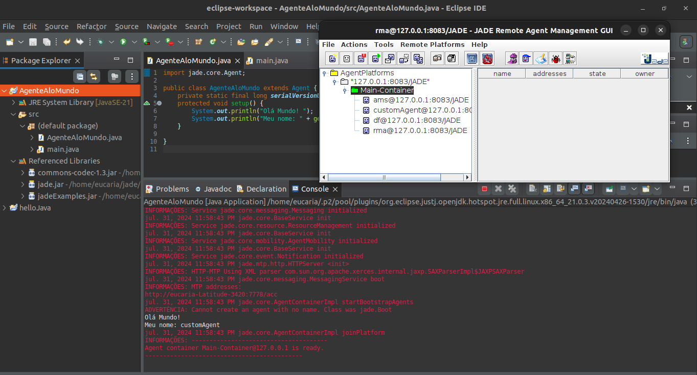

# Instalação e Uso no Eclipse

Este documento mostra como instalar e configurar o JADE no Ubuntu, utilizando o Eclipse para criar e executar um exemplo simples.

---

## 📝 Pré-requisitos
Antes de iniciar, certifique-se de ter instalado:
1. **JDK do Java** 
2. **Eclipse IDE**
obs: JDK 11 é a versão mais estável para o JADE
---

## 📥 Instalação do JADE

### 1. Baixar os Arquivos do JADE

- Acesse o [site oficial do JADE](https://jade.tilab.com/download/jade/?page_id=790) e baixe o arquivo jadeAll - `JADE-all-4.6.0.zip`.
- Extraia os arquivos na sua pasta pessoal `/home/seu-usuario`:
  
    ```bash
    jar xvf JADE-all-4.6.0.zip
    jar xvf JADE-bin-4.6.0.zip
    jar xvf JADE-src-4.6.0.zip
    jar xvf JADE-examples-4.6.0.zip
    jar xvf JADE-doc-4.6.0.zip
    ```
    **Recomendação**: Use o comando `jar xvf` para descompactar e evitar problemas de compatibilidade.


### 2. Configurar Variáveis de Ambiente

- No terminal, abra o arquivo `.bashrc`:
    ```bash
    sudo nano ~/.bashrc
    ```
- Adicione as seguintes linhas ao final do arquivo:
    ```bash
    # JADE
    export JADE_LIB=/home/{seu-usuario}/jade/lib
    export JADE_CP=$JADE_LIB/jade.jar:$JADE_LIB/jadeExamples.jar:$JADE_LIB/commons->
    alias rJade='java -cp $JADE_CP jade.Boot -gui'
    alias cJade='javac -cp $JADE_CP'
    ```
    **Lembrete**: Troque o valor de {seu-usuario} para o nome do seu usuário de fato.
- Salve as alterações (Ctrl+O, Enter, Ctrl+X) e atualize as configurações:
    ```bash
    source ~/.bashrc
    ```
- Reinicie o sistema:
    ```bash
    reboot
    ```

### 3. Testar a Instalação

- No terminal, execute o comando:
    ```bash
    rJade
    ```
- Deverá apresentar o seguinte resultado:

    

---

## 🤖 Criando o Agente Olá Mundo
### 1. Criar o Projeto no Eclipse
- Abra o Eclipse e crie um novo projeto Java chamado  `AgenteAloMundo` com o seguinte código:
- Adicione uma nova classe chamada `AgenteAloMundo` que extende da classe agente do jade.

    ```java
    import jade.core.Agent;

    public class AgenteAloMundo extends Agent {
        private static final long serialVersionUID = 1L;
        protected void setup() {
            System.out.println("Olá Mundo! ");
            System.out.println("Meu nome: " + getLocalName());
        }
    }
    ```
    **Observe**: A classe criada é uma extensão de uma classe agente do JADE
### 2. Adicionar Bibliotecas Externas
- Clique com o botão direito no projeto e selecione: `Build Path > Add External Archives`
    

- Adicione os seguintes arquivos da pasta lib do JADE: `jade.jar`, `jadeExemples.jar` e `commons-codec-1.3.jar`

### 3. Configurar a Execução
- Acesse a área de  `Run Configurations`
    
- Crie uma `Java Aplication`
  
  - **Name:** `AgenteAloMundo` 
  - **Project:** `AgenteAloMundo` 
  - **Main class:** `jade.Boot`
  - Na aba **Arguments**:  `-gui -local-host 127.0.0.1 -local-port 8083 customAgent:AgenteAloMundo`
      - **-gui**: Abre a interface gráfica do JADE.
      - **-local-host**: Define o host local **(Necessário para o Ubuntu).**
      - **-loal-port**: Define a porta **(Necessário para o Ubuntu).**
      - **customAgent**: Nome personalizado para o agente.
      - **AgenteAloMundo**: Classe do agente.
  - Clique em **Apply** e depois em **Run**.

---

### 🌟 Resultado Esperado
- Resultado no console:
    ```java
    Olá Mundo! 
    Meu nome: customAgent
    ```
- Interface gráfica do JADE deve estar aberta com o agente ativo.
  
