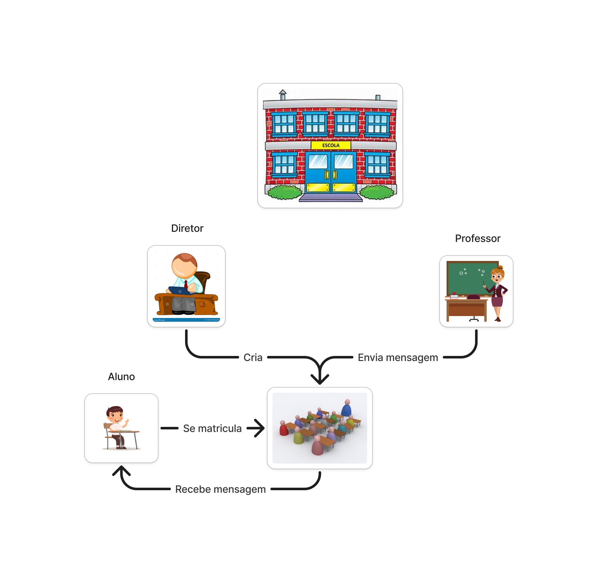

# Projeto Escola Multiagente

## Introdução

Os sistemas multiagentes são um modelo no qual entidades autônomas, chamadas de agentes, interagem entre si e com o ambiente para alcançar objetivos específicos. Esses sistemas têm ampla aplicação em cenários distribuídos, onde a colaboração ou competição entre agentes é essencial. Cada agente funciona de forma independente, mas interage com outros agentes e com o ambiente para atingir suas metas. Dependendo da situação, os agentes podem colaborar, competir ou operar de forma isolada, o que torna esse modelo ideal para sistemas dinâmicos e distribuídos.

O JADE (Java Agent Development Framework) é um framework em Java projetado para a criação de sistemas multiagentes, oferecendo funcionalidades como suporte à comunicação entre agentes e ao gerenciamento de seu ciclo de vida, além de outros recursos necessários para o desenvolvimento de aplicações distribuídas.

Neste projeto, simulei um ambiente escolar, onde agentes desempenham papéis específicos, relacionados à funções de pessoas em uma escola, como professores, gerentes de turmas, alunos e a própria escola. A imagem abaixo demonstra um diagrama simples que representa o funcionamento do sistema.

**Descrição:** Este diagrama representa a arquitetura de uma simulação de escola utilizando o paradigma de sistemas multiagentes. Ele ilustra como diferentes agentes (como alunos, professores e administradores) interagem entre si e com o ambiente escolar para realizar tarefas específicas, como aprendizado, gestão e interação social.

**Fonte:** Autoria própria.

### Agentes do Sistema

- **Ambiente escolar**: Responsável por criar novos alunos e professores.
  - Cria um professor inicial
  - Cria um novo aluno a cada 5 segundos
- **Aluno**: Está matriculado em turma.
  - Presta atenção na aula
  - Recebe mensagem dos professores
- **Gerente de turma**: Gerencia as turmas.
  - Cria nova turma quando uma chega no seu limite
  - Faz um relatório periódicamente sobre quantas turmas a escola tem, além de quantos alunos cada turma possui.
- **Professor**: Responsável por dar a aula.
  - Envia mensagens periódicamente aos alunos.
  - Inicia uma aula

### Etapas de Desenvolvimento

1. **Coordenação do Projeto**: Planejamento, integração de módulos e supervisão do progresso.
2. **Desenvolvimento dos Agentes**: Implementação dos comportamentos de cada agente.
3. **Comunicação entre Agentes**: Utilização do protocolo ACL (Agent Communication Language) do JADE.
4. **Documentação e Códigos**: Registro do processo.

## Estrutura do Projeto

### Criação do Projeto JADE

#### **Configuração do Ambiente**:
   - Instale o Java.
   - Baixe o JADE no [site oficial](https://jade.tilab.com/).
   - Descompacte os arquivos em _C:\jade_
   - Execute o script run.sh

#### **Classes Principais**:
   - [**AmbienteEscolar.java**](../src/main/java/com/school/AmbienteEscolar.java): Inicializa a escola, com um professor, um gerente de turma e adiciona alunos.
   - [**GerenteTurma.java**](../src/main/java/com/school/GerenteTurma.java): Imprime informações sobre as turmas e cria novas turmas.
   - [**Professor.java**](../src/main/java/com/school/Professor.java): Envia mensagens aos alunos.
   - [**Aluno.java**](../src/main/java/com/school/Aluno.java): Presta atenção na aula, recebe mensagens do professor.

### Estrutura de Código

O código completo das classes pode ser encontrado no repositório do projeto na seguinte pasta: [school-simulation/src/main/java/com/school](../src/main/java/com/school).

## Lições aprendidas
- Achei muito interessante como os agentes são "independentes" entre si, além da possibilidade da comunicação entre eles. Me lembrou bastante o paradigma de OO em alguns quesitos.
- É algo bem diferente da programação que lido no dia a dia, pensar no programa como um "ecossistema" vivo foi bem interessante.

## Percepções
- Não consegui me dedicar como gostaria para esse paradigma por fatores externos, isso me frustrou bastante, pois era o paradigma que eu estava com maiores expectativas no início do semestre.
- Desenvolver um projeto individualmente em um período tão curto, foi um desafio bem grande. Mesmo que o projeto seja mais simples, ter que lidar com os erros e corriji-los em um tempo tão curto foi bem desafiador.

## Contribuições e fragilidades
- Lidei com o desenvolvimento de todo o escopo do projeto.
- Tive uma dificuldade muito grande ao iniciar o projeto, já que havia um tempinho que não programava com java. Acabei tendo que relembrar muitos conceitos relacionados à sintaxe da linguagem, além do framework novo.

## Trabalhos futuros
- Gostaria de implementar diversas outras lógicas e comportamentos na escola, como provas, semestres, anos, reprovações, aprovações, alunos se formarem depois de tantos semestres. Enfim, são várias ideias que planejo revisitá-las e incrementar o projeto, mesmo fora do semestre letivo.

## Conclusão

O projeto "school-simulation" demonstrou conhecimentos e conceitos do paradigma multiagente para simulações distribuídas. A implementação em JADE permitiu explorar conceitos como comunicação e interação, simulando o comportamento de um ecossistema escolar.

## Bibliografia

> SERRANO, Milene. **Materiais da Disciplina de Paradigmas de Programação**. Faculdade de Ciências e Tecnologias em Engenharia (FCTE) – Campus Gama, Universidade de Brasília (UnB). Disponível em: [link](https://aprender3.unb.br/). Acesso em: 06 jan. 2025.

> FOUNDATION FOR INTELLIGENT PHYSICAL AGENTS. **FIPA** specifications. Disponível em: http://www.fipa.org/. Acesso em: 26 jan. 2025.

## Histórico de Versões

| Versão | Data       | Descrição                                                     | Autor                                              | Revisor                                               |
| ------ | ---------- | ------------------------------------------------------------- | -------------------------------------------------- | ----------------------------------------------------- |
| `1.0`  | 27/01/2025 | Versão inicial                                                | [Marcos Vinícius](https://github.com/marcos574) | - |

